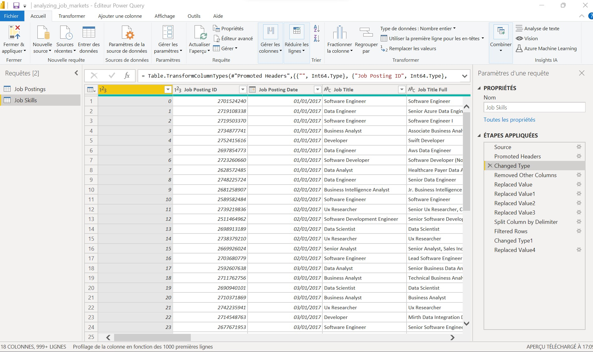

L'analyse des données d'entreprise joue aujourd'hui un rôle essentiel dans le fonctionnement des entreprises de tous les secteurs. En effet, la capacité à extraire des informations à partir de données offre la possibilité de mieux aligner les stratégies et accélère la réalisation des objectifs. Tout cela se traduit finalement par le développement de l'entreprise et la croissance du marché. Comment Power BI peut-il vous aider ? Vous lirez à ce sujet dans la partie suivante de l'article.

De nombreuses organisations ont adopté Power BI comme principal outil de Business Intelligence. Il est robuste et puissant (traitant jusqu'à 100 millions de lignes de données), ce qui en fait un outil essentiel pour les entreprises de différents secteurs pour convertir les données brutes en une variété d'informations exploitables.

## 1.	Visualisez vos données avec de superbes graphiques no-code

Les outils de création de graphiques de Power BI sont puissants et faciles à utiliser et ne nécessitent aucun codage. Power BI a tout pour plaire notamment les graphiques traditionnels comme les histogrammes et les graphiques en courbes et jauge. En maîtrisant la visualisation des données dans Power BI, vous pourrez créer de beaux graphiques personnalisables et créer un impact avec votre analyse.

## 2.	Calculez ces chiffres avec DAX

Si vous avez déjà pensé que "Les formules Excel sont utiles, mais je veux quelque chose de mieux", alors DAX est fait pour vous ! DAX est le langage de script de Power BI et ressemble étroitement à la syntaxe des formules Excel. Il fournit un moyen simple mais puissant de calculer des chiffres sur votre ensemble de données.

## 3.	Manipulez et transformez vos données

Comme le savent tous les analystes de données, les données ne sont jamais au format souhaité lorsque vous les recevez. Heureusement, Power BI inclut des outils puissants pour préparer et transformer vos données en vue de leur analyse. Avec le langage M et l'éditeur avancé de Power BI, vous créerez des transformations de données robustes qui feront passer vos données brutes à prêtes pour l'analyse.

## 4.	Racontez l'histoire de vos données avec des tableaux de bord interactifs

En son cœur, Power BI consiste à créer des tableaux de bord interactifs pour vous aider à comprendre vos données.

## 5.	Partagez vos rapports avec vos collègues et le monde

La valeur de l'analyse des données provient des décisions qui sont prises à partir des résultats. Pour ce faire, vous devez partager vos résultats avec vos collègues ou le monde entier. Power BI fournit une gamme d'outils de partage pour mettre vos tableaux de bord à la disposition des autres.

