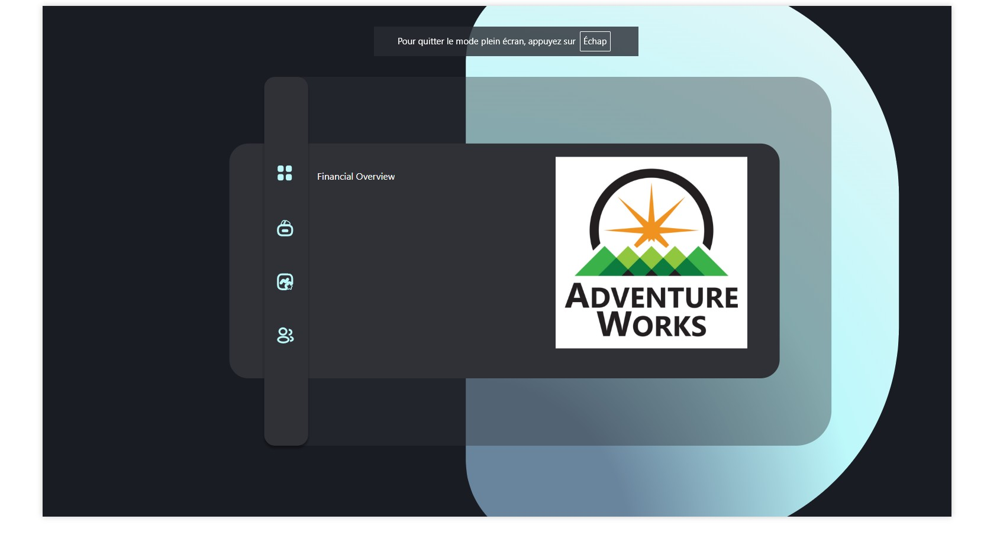
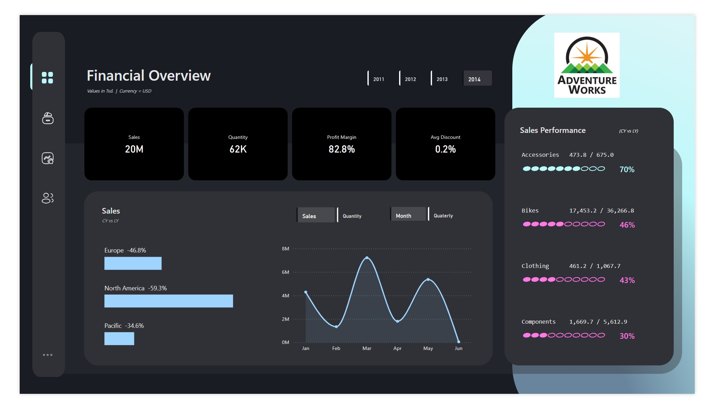
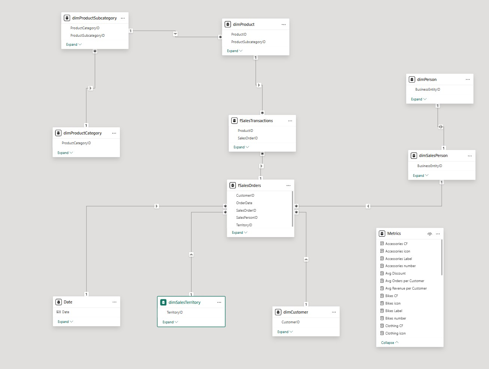

## 📘 Project Overview

This Power BI report provides an interactive **Financial Overview Dashboard** built on the classic **AdventureWorks** dataset.  
It is designed to simulate a real-world business intelligence use case for monitoring financial performance across time and comparing key KPIs.

The project includes:

- 🏠 **Home Page**  
  A simple landing page that introduces the report and offers intuitive navigation for users.

*The landing page provides a clean entry point to the report.*

- 💰 **Financial Overview Dashboard**  

*A dynamic financial dashboard showing profit performance and trends.*

  A comprehensive page focused on financial KPIs, including:
  - **Total Sales**
  - **Total Cost**
  - **Net Profit**
  - **Profit Margin**
---

## 📊 KPIs & DAX Highlights

- **Total Sales**  
  Based on the `LineTotal` from the `SalesOrderDetail` fact table.

- **Total Cost**  
  Calculated using `OrderQty × StandardCost`, joined from the `Product` dimension.

- **Net Profit**  
  Defined as `Total Sales - Total Cost`.

- **Profit Margin**  
  Calculated using `Net Profit / Total Sales`.

---

## 🧠 Modeling Approach

The report uses a clean **star schema** structure:

- `fSalesTransactions` as the central **fact table**
- Connected dimension tables:  
  - `dimProduct`  
  - `dimCustomer`  
  - `dimSalesPerson`  
  - `dimSalesTerritory`  
  - `dimDate` (custom calendar table)

All relationships are one-to-many, using surrogate keys for optimal performance.

  
*A star schema data model connecting fact and dimension tables for optimal performance.*

---

## 🛠️ Tools & Techniques

- **Power BI Desktop**
- **DAX** for KPIs and time intelligence
- **Star schema modeling**
- **Custom visuals** and **navigation buttons**
- **Bookmarks** for user interaction

---