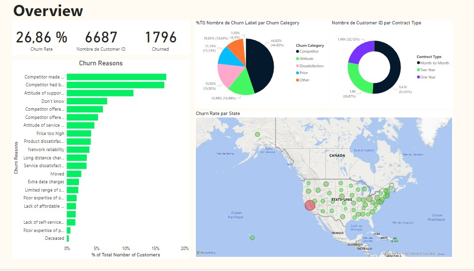
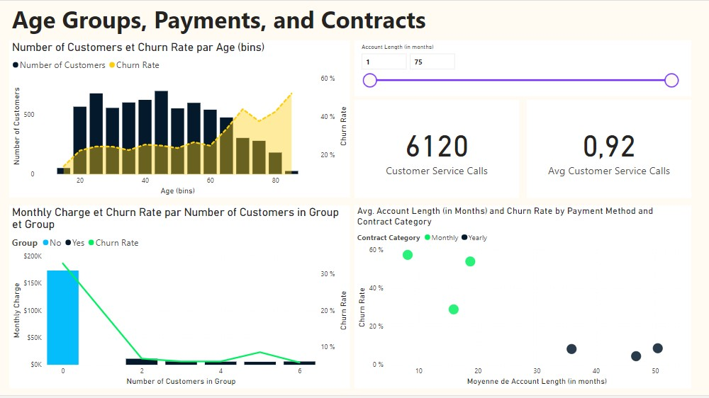
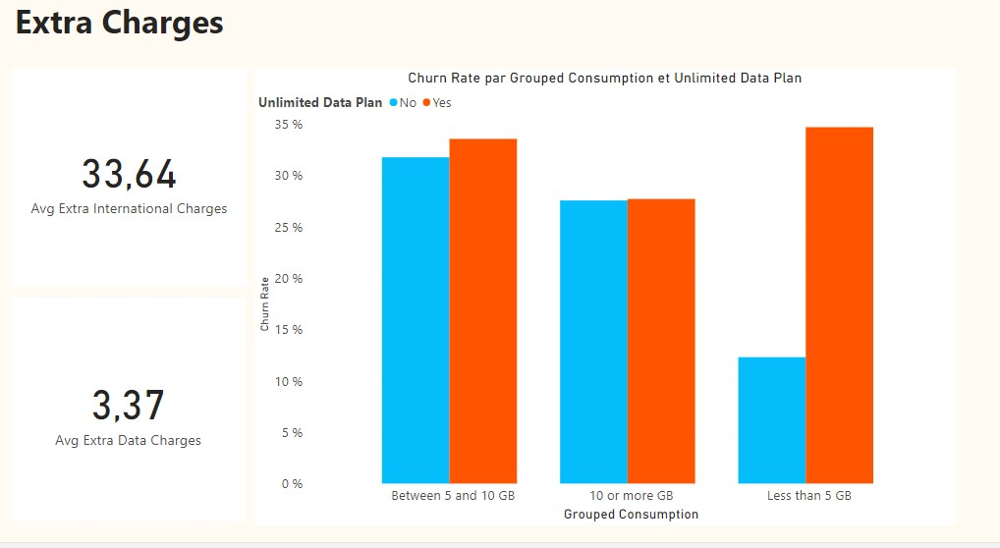
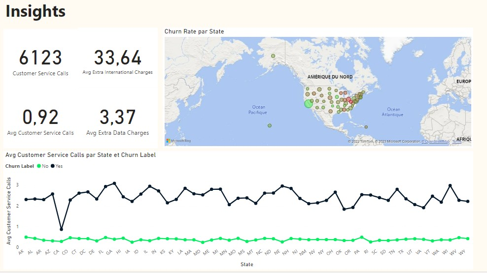

Analyzing churn doesn’t just mean knowing what the churn rate is: it’s also about figuring out why customers are churning at the rate they are, and how to reduce churn.
We'll answer these questions by creating measures and calculated columns, while simultaneously creating eye-catching report pages.

