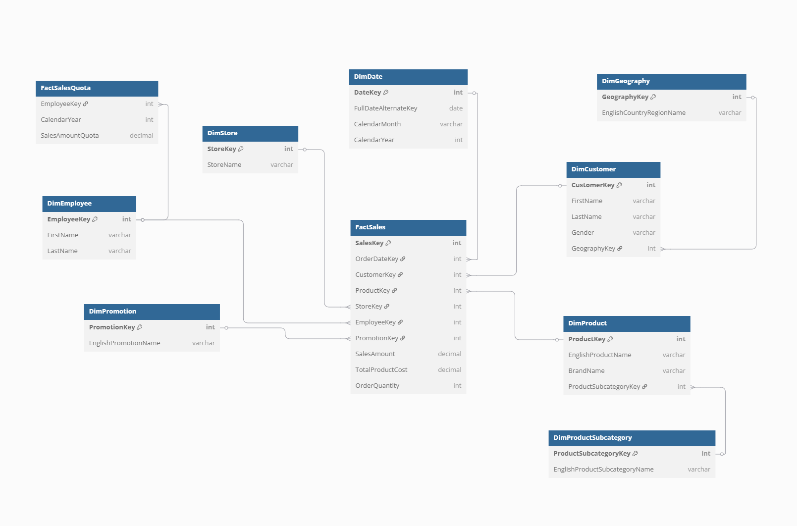

In this SQL project, I analyze transactional data from Microsoft's **ContosoRetailDW** sample data warehouse. The focus is on **in-store sales only**, using the `FactSales` fact table and dimension tables for stores, geography, products, and time.


##  Data Model Overview

The project centers around the `FactSales` fact table and its related dimension tables:

- `DimDate` — calendar and date hierarchy  
- `DimProduct`, `DimProductSubcategory` — product and brand details  
- `DimStore` — physical store information  
- `DimGeography` — city, state, country for each store



## Streamlined Data Cleaning with a SQL View

To ensure data quality and facilitate consistent analysis, a reusable SQL view, `vw_CleanedSales`, is implemented. This view performs essential joins and enriches the raw sales data with relevant contextual information from the dimension tables.

```sql
CREATE OR ALTER VIEW vw_CleanedSales AS
SELECT
    fs.SalesKey,
    d.FullDateLabel AS OrderDate,
    ps.ProductSubcategoryName AS Subcategory,
    p.ProductName AS ProductName,
    p.BrandName,
    s.StoreName,
    g.CityName,
    g.StateProvinceName,
    g.RegionCountryName,
    fs.SalesAmount,
    fs.TotalCost,
    fs.SalesAmount - fs.TotalCost AS Profit,
    fs.SalesQuantity
FROM FactSales fs
JOIN DimDate d ON fs.DateKey = d.DateKey
JOIN DimProduct p ON fs.ProductKey = p.ProductKey
JOIN DimProductSubcategory ps ON p.ProductSubcategoryKey = ps.ProductSubcategoryKey
JOIN DimStore s ON fs.StoreKey = s.StoreKey
JOIN DimGeography g ON s.GeographyKey = g.GeographyKey
WHERE fs.SalesAmount > 0;
```

## Key Analytical Queries and Insights

The following SQL queries are designed to extract insights from the cleaned sales data:

#### Revenue by product subcategory

This query aggregates sales revenue at the product subcategory level, allowing for the identification of top-performing product segments.

```SQL
SELECT
    Subcategory,
    SUM(SalesAmount) AS TotalRevenue
FROM vw_CleanedSales
GROUP BY Subcategory
ORDER BY TotalRevenue DESC;
```
#### Monthly sales trends

This query examines the trend of monthly sales revenue, providing a temporal perspective on sales performance.

```SQL
SELECT
    LEFT(OrderDate, 7) AS Month,
    SUM(SalesAmount) AS MonthlyRevenue
FROM vw_CleanedSales
GROUP BY LEFT(OrderDate, 7)
ORDER BY Month;
```

#### Profitability by store

This query calculates the total profit generated by each store, enabling the identification of the most and least profitable locations.

```SQL
SELECT
    StoreName,
    SUM(Profit) AS TotalProfit
FROM vw_CleanedSales
GROUP BY StoreName
ORDER BY TotalProfit DESC;
```

#### Geographic revenue insights

This query provides a geographical perspective on sales revenue, broken down by country and state/province.

```SQL
SELECT
    RegionCountryName AS Country,
    StateProvinceName,
    SUM(SalesAmount) AS Revenue
FROM vw_CleanedSales
GROUP BY RegionCountryName, StateProvinceName
ORDER BY Revenue DESC;
```

#### Average order by store

This query calculates the average transaction value for each store, offering insights into customer spending habits across different locations.

```SQL
SELECT
    StoreName,
    COUNT(DISTINCT SalesKey) AS TotalOrders,
    SUM(SalesAmount) AS TotalRevenue,
    ROUND(SUM(SalesAmount) / COUNT(DISTINCT SalesKey), 2) AS AvgOrderValue
FROM vw_CleanedSales
GROUP BY StoreName
ORDER BY AvgOrderValue DESC;
```

#### Top brands by profit

This query identifies the top 10 brands based on their total profit contribution.

```SQL
SELECT TOP 10
    BrandName,
    SUM(Profit) AS TotalProfit
FROM vw_CleanedSales
GROUP BY BrandName
ORDER BY TotalProfit DESC;
```

All SQL scripts are modular and version-controlled on GitHub. Screenshots of outputs are included to showcase query results.
