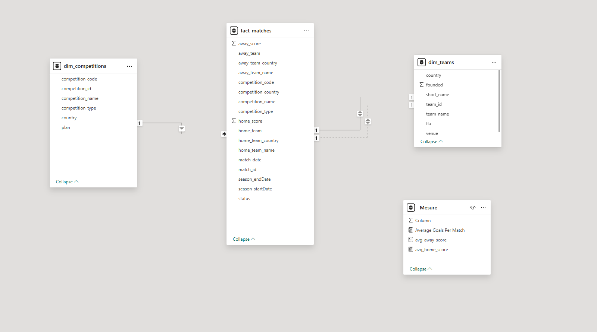
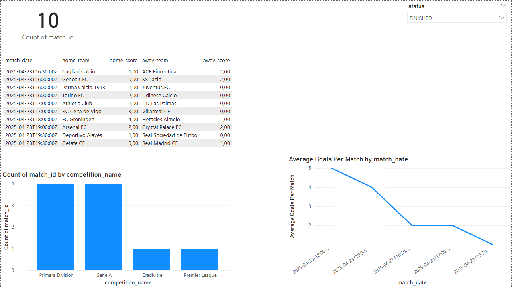
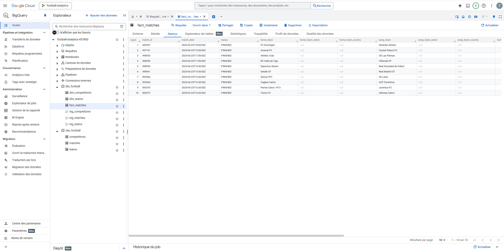
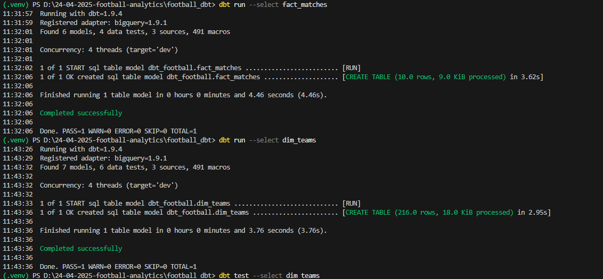
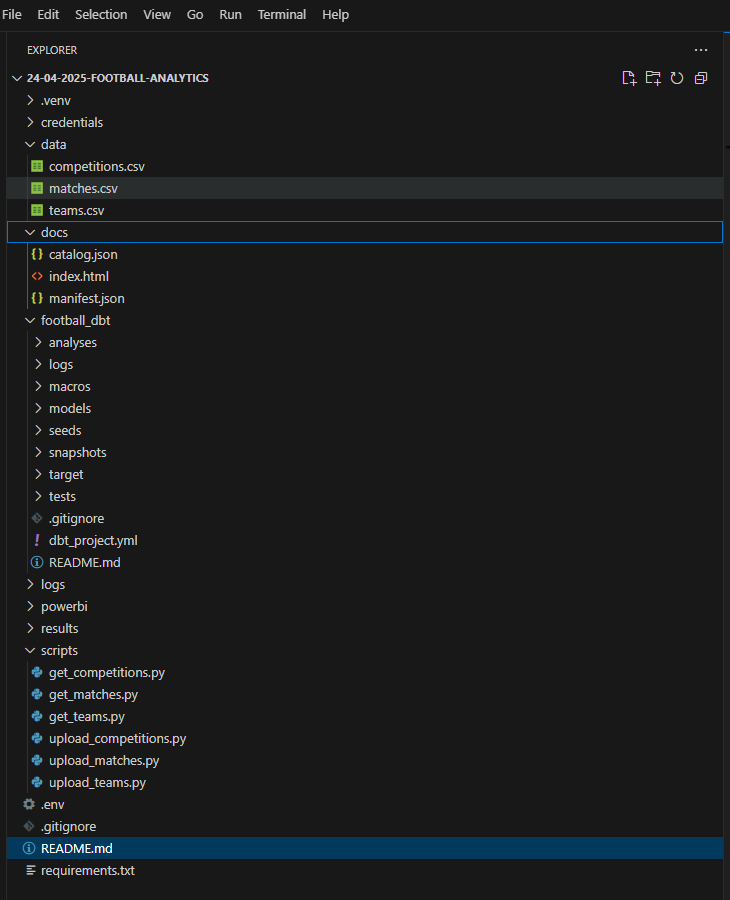

## Project Overview

This project demonstrates a complete, modern data analytics pipeline for football data. It showcases the journey from **raw API data** to a **production-ready, interactive dashboard**, built entirely with cutting-edge tools:

- **Data Ingestion:** Automated using **Python scripts** for efficient data collection.
- **Cloud Data Warehouse:** Leveraging the power and scalability of **Google BigQuery** for storage and querying.
- **Data Transformation & Modeling:** Implementing robust data pipelines with **dbt (data build tool)** for clean and insightful models.
- **Interactive Visualization:** Creating compelling dashboards in **Power BI** for data exploration and storytelling.

---

## Tech Stack

- **Python:** Used for scripting the data ingestion process from a public football API.
- **Google BigQuery:** Serves as the central data warehouse for storing and efficiently querying structured football data.
- **dbt (data build tool):** Automates data transformations and modeling within BigQuery, ensuring data quality and consistency.
- **Power BI Desktop:** Enables the creation of interactive and visually appealing dashboards for data analysis and presentation.

---

## Data Source

The football data (including matches, teams, and competitions) was sourced from a free public API and initially stored in the following raw BigQuery dataset and tables:

**Dataset:** `raw_football`
**Tables:**
- `matches`
- `teams`
- `competitions`

---

## Data Pipeline Overview

| Step      | Tool     | Description                              |
|-----------|----------|------------------------------------------|
| Ingestion | Python   |  Extract data from API and save as CSV   |
| Load      | BigQuery | Upload CSVs to raw tables                |
| Transform | dbt      | Create staging + fact + dimension models |
| Visualize | Power BI | Final interactive dashboard              |

---

## Data Transformation with dbt

 dbt project (`football_dbt`) organizes data models into logical layers for clarity and maintainability:

- **Staging Models (`staging/`):** Basic transformations to clean and standardize raw data from the source tables (`stg_matches`, `stg_teams`, `stg_competitions`).
- **Core Models (`marts/fact/`):** Fact tables containing key business metrics, such as the `fact_matches` table, which combines and enriches match data.
- **Dimension Models (`marts/dim/`):** Dimension tables providing contextual information, like the deduplicated `dim_teams` and `dim_competitions` tables.

To build and test all dbt models, run the following commands in your terminal within the `dbt/football_dbt/` directory:

```bash
dbt run
dbt test
```

Models include tests (`not_null`, `unique`) and are documented via dbt.

---
## Power BI Dashboard

### Sample Visualizations

#### Data Model Overview
A visual representation of the relationships between different tables in the Power BI data model.



#### Example Dashboard Visual
An example of an interactive visualization created in the Power BI dashboard.


---

## Folder Structure

```bash
football-analytics-project/
├── datasets/             # CSV export from API
├── scripts/              # Python data ingestion
├── dbt/football_dbt/     # dbt project
├── powerbi/              # Power BI .pbix file
├── results/              # Exported visuals
├── docs/                 # dbt documentation (static)
├── README.md
├── .gitignore
└── requirements.txt      # List of Pyhton dependencies
```

## Technical Pipeline Overview

### 1. Fetching Data from Public API
The scripts/ directory contains Python scripts (e.g., upload_matches.py - though not shown in the original snippet, it's implied) to fetch data from the football API. Here's a snippet illustrating the data retrieval process:

```python
import os
import requests
import pandas as pd
from dotenv import load_dotenv

# Load your API key
load_dotenv()
API_KEY = os.getenv("FOOTBALL_API_KEY")

# API setup
url = "https://api.football-data.org/v4/matches"
headers = {"X-Auth-Token": API_KEY}

response = requests.get(url, headers=headers)

if response.status_code == 200:
    data = response.json()
    matches = pd.json_normalize(data['matches'])
    print(matches[['homeTeam.name', 'awayTeam.name', 'score.fullTime.home', 'score.fullTime.away']].head())
else:
    print("Error:", response.status_code, response.text)
    
matches.to_csv("data/matches.csv", index=False)
```

### 2. Loading and Previewing Matches in BigQuery

A screenshot showing the matches table within the raw_football dataset in Google BigQuery.



### 3. dbt Run and Transformation

A screenshot indicating a successful dbt run, showing the transformation and testing of data models.



### 4. Project Structure in VS Code

A view of the project structure within Visual Studio Code, highlighting the organization of different components.


