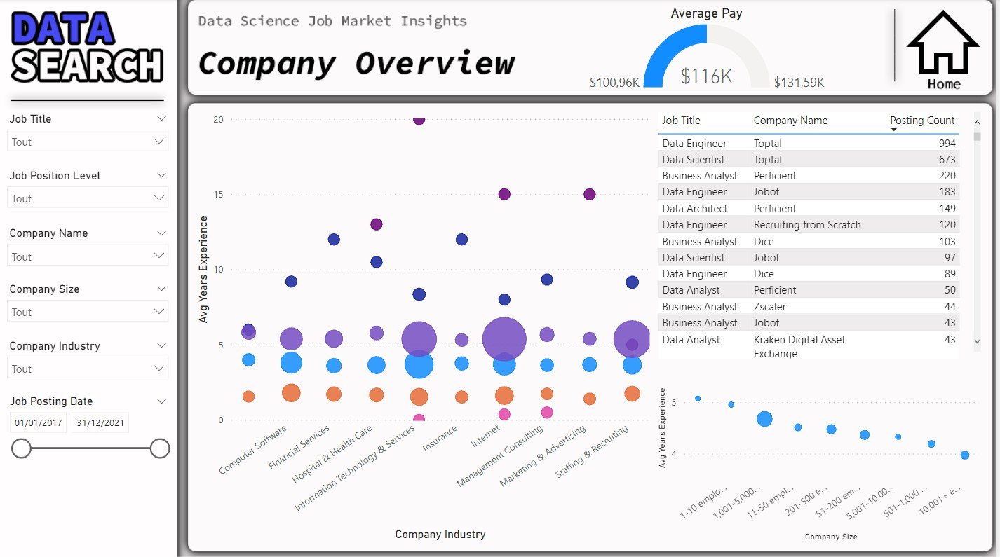
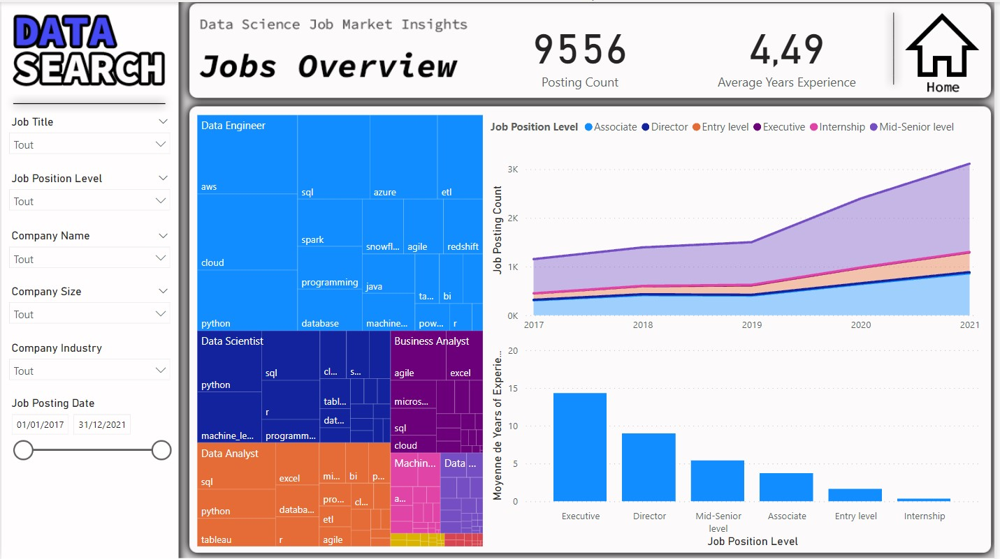
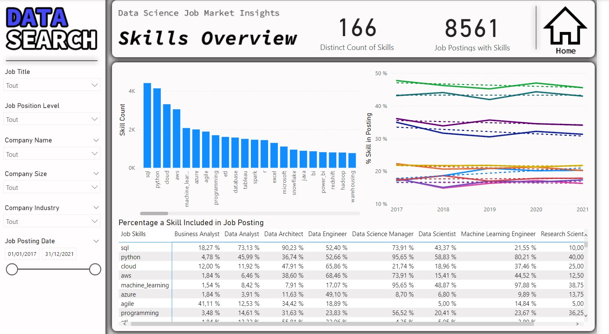

In this Power BI project, we’ll explore a real-world job posting dataset to uncover insights for a fictional recruitment company called DataSearch. We’ll use Power Query to investigate and clean the data to find out what skills are most in-demand for data scientists, data analysts, and data engineers. 
We’ll then use DAX to build insightful visualizations of our findings. Finally, we’ll bring it all together using everything Power BI has to offer to create a business dashboard so that we can answer questions for the DataSearch team.

